[TOC]

# ✨ SSACRETARY ✨

> 개발기간 : '21.10.12(화) ~ 11.19(금) (6주)
>
> 배포 주소: https://k5a402.p.ssafy.io/

## 🤔왜 SSACRETARY을 만들었나요?

1. 사용자가 찾고자 하는 검색어의 정보를 찾아서 해당 검색어에 대한 알림을 주기 위해
2. 기존 알림 서비스가 지원하지 않는 사이트에서도 사용할 수 있고, 쉬운 UI를 구성하여 사용자의 편의성을 높이기 위해

** 찾는 정보에 대한 알림을 내가 설정하여 받아보고 싶은 분를 위해 제작을 시작한 서비스입니다**

## 팀원 소개 및 담당역할

> 담당 역할, 기술

#### 유태규 (팀장)

- 프로젝트 매니지먼트
- UI/UX 구성 및 FE 담당자 (React)

#### 김지현 (부팀장)

- 프로젝트 매니지먼트(Sub)
- BE 담당자 (SpringBoot)

#### 장범진(서기)

- 프로젝트 매니지먼트
- UI/UX 구성 및 FE 담당자 (React)

## 🎥프로젝트 소개

> 내가 원하는 사이트에서 내가 원하는 키워드를 찾을 수 있게 해주는 서비스
>
> 찾으면 내게 알려주는 서비스

### 간략한 기능 미리보기

#### 서비스1

내가 원하는 사이트에서 내가 원하는 키워드를 내가 원하는 주기마다 검색하는 기능

#### 서비스2

검색결과를 이메일로 받아볼 수 있는 기능

## 💻개발 스택

#### Frontend

- React, TypeScript, Material-UI

#### Backend

- SpringBoot, Node.js

#### DataBase

- MySQL

#### 배포

- AWS, Jenkins, Nginx

#### 협업툴

- JIRA(일정관리), Gitlab(코드관리)
- Google Docs(정리용), Webex, Discord(스크럼미팅)

## ⚙Getting Started

> 프로젝트 환경설정

#### backend (SpringBoot)

"src/backend" directory 상에서

```bash

```

#### frontend (React)

"src/frontend" directory 상에서

```bash
$ npm install
$ npm start
```

#### Server

> [배포문서 참고]()

## 🎨Design

> - Design Mockup (Web용)

### Mobile

- 로그인 & 회원가입

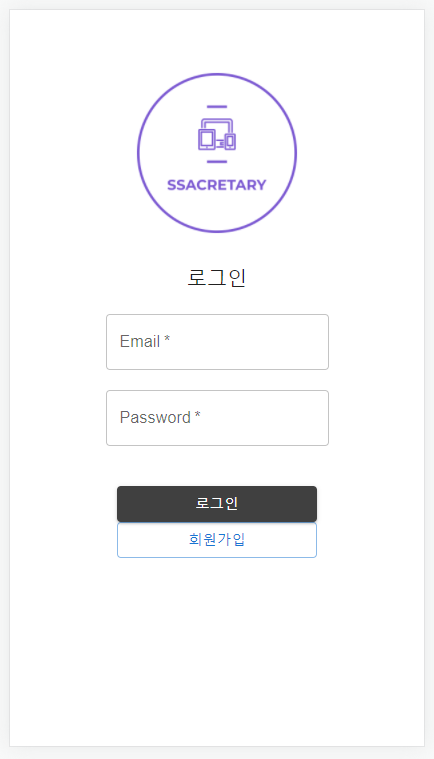

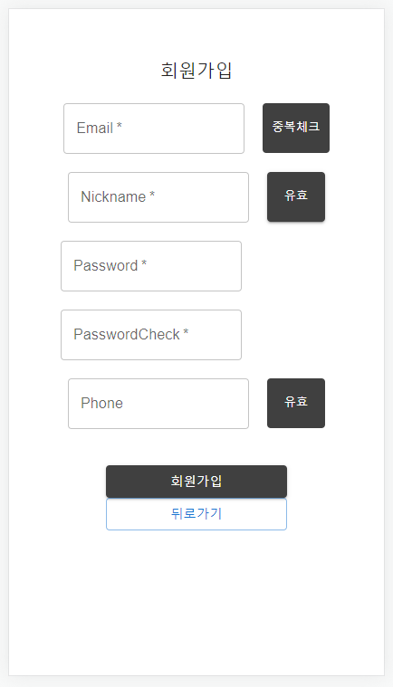

- 크롤링 리스트 & 크롤링 상세보기

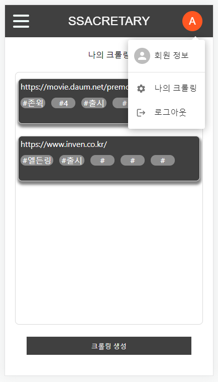

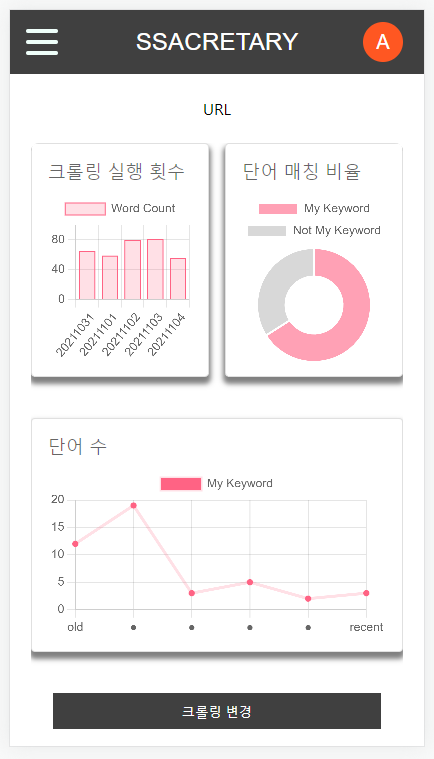

- 로그 조회

- 크롤링 생성 & 수정

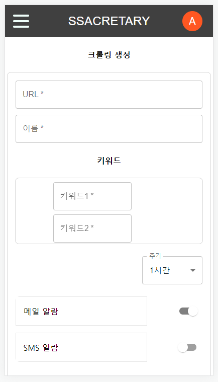

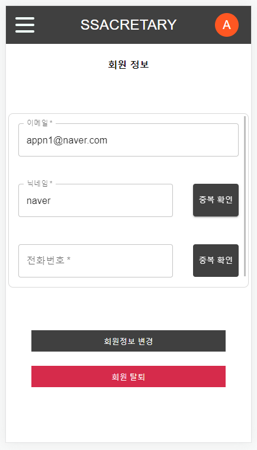

### Web

- 로그인

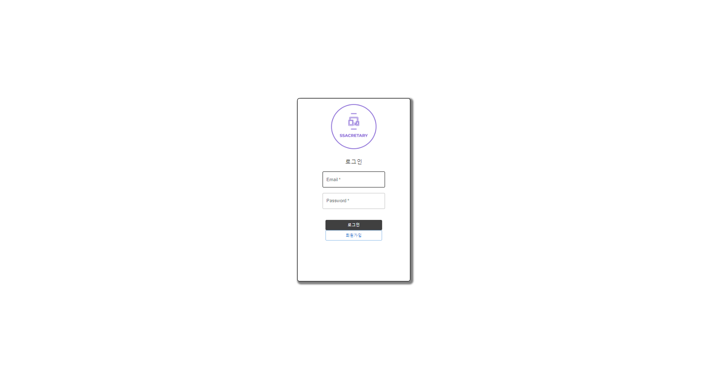

- 회원가입

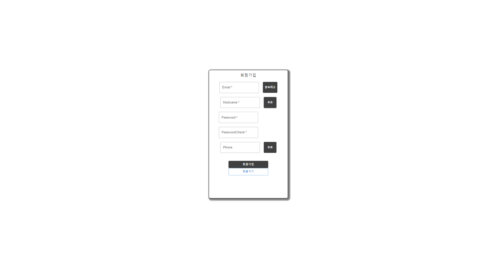

- 회원정보 수정

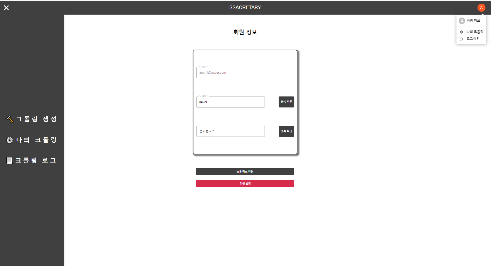

- 크롤링 리스트

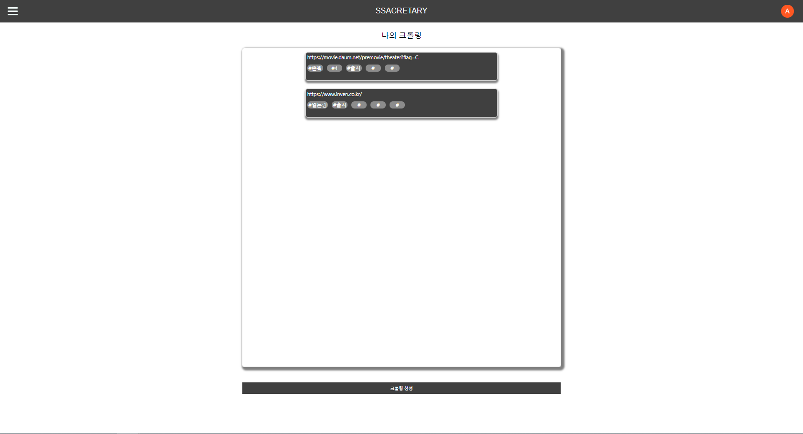

- 크롤링 상세

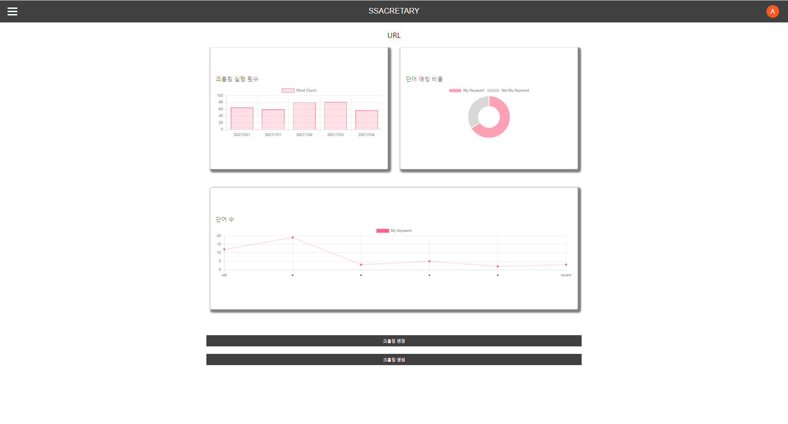

- 크롤링 생성

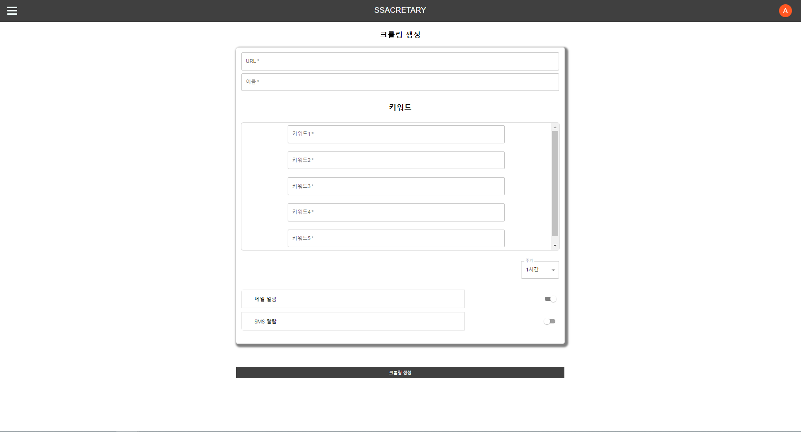

- 크롤링 수정

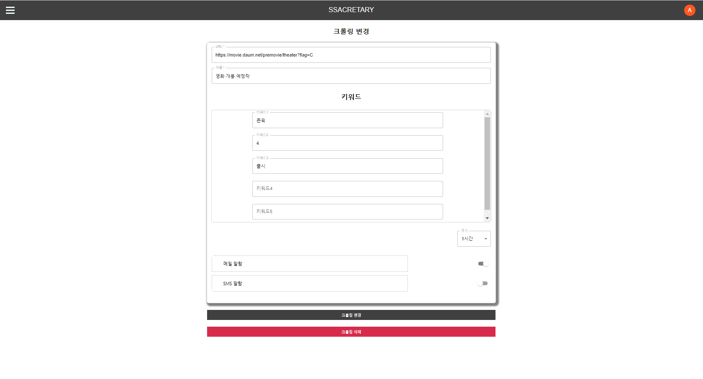

- 크롤링 로그

## 📃네이밍 규칙

### 1. Commit Message

#### Commit Rule

```markdown
<type>(<scope>): <subject> -- 헤더
<BLANK LINE>

<body>                              -- 본문
<BLANK LINE>
<footer>                            -- 바닥글
_____________________________________________
Feat(): "추가 로그인 함수"

로그인 API 개발

Resolves: #123
Ref: #456
Related to: #48, #45
```

#### Type

- **Feat** : 새로운 기능에 대한 커밋
- **Build** : 빌드 관련 파일 수정에 대한 커밋
- **Fix** : 버그 수정에 대한 커밋
- **Ci** : CI관련 설정 수정에 대한 커밋
- **Docs** : 문서 수정에 대한 커밋
- **Style** : 코드 스타일 혹은 포맷 등에 관한 커밋
- **Refactor** : 코드 리팩토링에 대한 커밋
- **Test** : 테스트 코드 수정에 대한 커밋

### 2. Branch

#### Branch Rule

- `Master` branch : 제품으로 출시될 수 있는 브랜치
  배포(Release) 이력을 관리하기 위해 사용. 즉, 배포 가능한 상태만을 관리한다.
- `Develop` branch : 다음 출시 버전을 개발하는 브랜치
  기능 개발을 위한 브랜치들을 병합하기 위해 사용.

  모든 기능이 추가되고 버그가 수정되어 배포 가능한 상태라면 `Develop` 브랜치를 `Master`브랜치에 **Merge**한다.

  평소에는 Develop 브랜치를 기반으로 개발을 진행한다.

- `Feature` branch : 기능을 개발하는 브랜치 ( Ex) `feature/login` )
  새로운 기능 개발 및 버그 수정이 필요할 때마다 `Develop` 브랜치로부터 분기하여 사용.

  `Feature` 브랜치에서의 작업은 기본적으로 공유할 필요가 없기 때문에, 로컬 저장소에서 관리함.

  개발이 완료되면 `Develop` 브랜치로 **Merge**하여 다른사람들과 공유한다.

  1.  `Develop` 브랜치에서 새로운 기능에 대한 `Feature` 브랜치를 분기
  2.  새로운 기능에 대한 작업 수행
  3.  작업이 끝나면 `Develop` 브랜치로 **Merge**
  4.  더 이상 필요하지 않은 `Feature` 브랜치는 삭제
  5.  새로운 기능에 대한 `Feature` 브랜치를 중앙 원격 저장소에 **Push**

- `Hotfix` branch : 출시 버전에서 발생한 버그를 수정 하는 브랜치 ( Ex) `hotfix-1.2.1` )
  배포한 버전에 긴급하게 수정을 해야 할 필요가 있을 경우 `Master` 브랜치에서 분기하는 브랜치.

  1.  배포 버전에 수정이 필요한 경우 `Master` 브랜치에서 `Hotfix` 브랜치를 분기한다.
  2.  문제가 되는 부분만 빠르게 수정한다.
  3.  다시 `Master` 브랜치에 **Merge**하여 배포한다.
      - 새로운 버전 이름으로 태그를 매긴다.
  4.  `Hotfix` 브랜치에서 변경 사항은 `Develop` 브랜치에도 **Merge**한다.


### 3. Jira Issue

```markdown
- Epic (큰틀) :프로세스 단위로 구분 (기획, 설계, 구현, 테스트)
  ex) 회원관리 서비스 기획

- Story (이야기) : “{사용자} 로써 {무엇}을 하고싶다” 에 대한 액터의 유즈케이스
  ex) Frontend 설계 - 로그인 페이지 설계, Backend 설계 - DB 환경 검토 및 설정

- Sub Task (부작업) : 스토리 혹은 초어들을 개발하기 위해 진행되는 실제 세부 개발사항들
  ex) Frontend - onClick 함수 연결, Backend - 비밀번호 해싱 함수 구현

- Task (작업) : 구현에는 직접적으로 관련이 없는 업무 (문서작성 등)
  ex) 회원관리 서비스 기획 문서화(.ppt, .md ...), AWS 환경 설정

- Bug (버그) : 테스트 엔지니어로부터 버그로 리포팅된 타입
  ex) 로그인 버튼 5번 누르면 관리자로 로그인 되는 문제 발생
```

### 4. 클래스 / 변수명

> 무슨 목적인지 이해하기 쉽도록 최대한 자세하게 작성

#### 1. Class

- PascalCase

#### 2. variable / function

- camelCase

#### 3. 상수

- UPPERCASE

## 💡배운점, 느낀점, etc

> 프로젝트 진행하면서 배운 내용, 느낀점, 좋았던점, 아쉬운점 등

- 유태규
  - 생각지도 못한 걸 생각보다 많이 하게 된 프로젝트였습니다.
- 장범진
  - 소수 정예로 많은 것을 학습하고 성장할 수 있었던 프로젝트 였습니다.

- 김지현
  - 프로젝트 끝까지 취업을 못해서 찐 남겨진 사람이 되어서 슬프네요.

